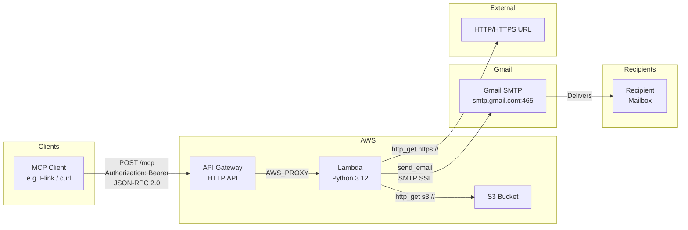

# MCP Email Server

A generic [Model Context Protocol (MCP)](https://modelcontextprotocol.io) server for sending email via Gmail SMTP, deployed as an AWS Lambda function behind API Gateway.

Any MCP-compatible client can connect to it — Claude, Cursor, custom clients, or direct HTTP calls via curl.

## Architecture



> **Cold start note:** the first request after a period of inactivity takes 1–3 seconds while Lambda initialises the runtime. Subsequent warm requests complete in well under a second.

## Tools

| Tool | Description |
|---|---|
| `send_email` | Send a plain-text or HTML email to one or more recipients, with optional CC |
| `send_email_with_reply_to` | Same as above, with a custom Reply-To address |
| `http_get` | Fetch data from an `http://`, `https://`, or `s3://` URL and return the response as JSON |
| `http_post` | POST a JSON payload to an `http://` or `https://` endpoint and return the response |

## Prerequisites

| Requirement | Notes |
|---|---|
| AWS CLI | Configured with credentials that have Lambda + API Gateway permissions |
| IAM role | A Lambda execution role with `AWSLambdaBasicExecutionRole` attached |
| Python 3.12 + pip3 | For building the deployment package locally |
| Gmail App Password | 2FA must be enabled on the Gmail account; generate at [myaccount.google.com/apppasswords](https://myaccount.google.com/apppasswords) |

## Deploy

```bash
export LAMBDA_ROLE_ARN=arn:aws:iam::<account-id>:role/<role-name>
export GMAIL_USER=you@gmail.com
export GMAIL_APP_PASSWORD=xxxx-xxxx-xxxx-xxxx
export MCP_API_KEY=<your-secret-key>

bash deploy.sh
```

The script will:
1. Build a Lambda-compatible deployment package
2. Create or update the Lambda function
3. Set environment variables on the function
4. Create or update an API Gateway HTTP API pointing at the function

The MCP endpoint URL is printed at the end.

## Environment variables (Lambda)

| Variable | Description |
|---|---|
| `GMAIL_USER` | Gmail address used as the sender |
| `GMAIL_APP_PASSWORD` | Gmail App Password (not your account password) |
| `MCP_API_KEY` | Secret key clients must pass in the `x-api-key` header |

## Connecting an MCP client

Add the following to your MCP client's config (see `mcp_client_config_example.json`):

```json
{
  "mcpServers": {
    "email-sender": {
      "url": "https://<your-api-gateway-url>/mcp",
      "headers": {
        "x-api-key": "<your-mcp-api-key>"
      }
    }
  }
}
```

## Testing with curl

**List available tools:**
```bash
curl -X POST https://<your-api-gateway-url>/mcp \
  -H "Content-Type: application/json" \
  -H "Accept: application/json, text/event-stream" \
  -H "x-api-key: $MCP_API_KEY" \
  -d '{"jsonrpc": "2.0", "id": 1, "method": "tools/list", "params": {}}'
```

**Send an email:**
```bash
curl -X POST https://<your-api-gateway-url>/mcp \
  -H "Content-Type: application/json" \
  -H "Accept: application/json, text/event-stream" \
  -H "x-api-key: $MCP_API_KEY" \
  -d '{
    "jsonrpc": "2.0",
    "id": 1,
    "method": "tools/call",
    "params": {
      "name": "send_email",
      "arguments": {
        "to": "recipient@example.com",
        "subject": "Hello",
        "body": "Hello from the MCP email server!"
      }
    }
  }'
```

**Send an HTML email with CC:**
```bash
curl -X POST https://<your-api-gateway-url>/mcp \
  -H "Content-Type: application/json" \
  -H "Accept: application/json, text/event-stream" \
  -H "x-api-key: $MCP_API_KEY" \
  -d '{
    "jsonrpc": "2.0",
    "id": 1,
    "method": "tools/call",
    "params": {
      "name": "send_email",
      "arguments": {
        "to": "recipient@example.com",
        "subject": "Hello",
        "body": "<h1>Hello</h1><p>From the MCP email server.</p>",
        "cc": "other@example.com",
        "is_html": true
      }
    }
  }'
```

**Send with a custom Reply-To:**
```bash
curl -X POST https://<your-api-gateway-url>/mcp \
  -H "Content-Type: application/json" \
  -H "Accept: application/json, text/event-stream" \
  -H "x-api-key: $MCP_API_KEY" \
  -d '{
    "jsonrpc": "2.0",
    "id": 1,
    "method": "tools/call",
    "params": {
      "name": "send_email_with_reply_to",
      "arguments": {
        "to": "recipient@example.com",
        "subject": "Hello",
        "body": "Please reply to the support address.",
        "reply_to": "support@example.com"
      }
    }
  }'
```

**Fetch from an HTTPS URL:**
```bash
curl -X POST https://<your-api-gateway-url>/mcp \
  -H "Content-Type: application/json" \
  -H "Accept: application/json, text/event-stream" \
  -H "x-api-key: $MCP_API_KEY" \
  -d '{
    "jsonrpc": "2.0",
    "id": 1,
    "method": "tools/call",
    "params": {
      "name": "http_get",
      "arguments": {
        "url": "https://example.com/data.json"
      }
    }
  }'
```

**Fetch from an S3 URL (Lambda role must have `s3:GetObject`):**
```bash
curl -X POST https://<your-api-gateway-url>/mcp \
  -H "Content-Type: application/json" \
  -H "Accept: application/json, text/event-stream" \
  -H "x-api-key: $MCP_API_KEY" \
  -d '{
    "jsonrpc": "2.0",
    "id": 1,
    "method": "tools/call",
    "params": {
      "name": "http_get",
      "arguments": {
        "url": "s3://my-bucket/path/to/file.csv"
      }
    }
  }'
```

> **S3 access:** for `s3://` URLs, the Lambda execution role must have `s3:GetObject` on the target bucket. No credentials are passed in the request — the role's permissions apply automatically.

## Project structure

```
.
├── lambda_function.py            # MCP server + email logic
├── requirements.txt              # Python dependencies
├── deploy.sh                     # Build and deploy to AWS
├── mcp_client_config_example.json  # Example MCP client config
└── README.md
```

Generated by `deploy.sh` (excluded from version control):
```
.target/
├── package/        # Lambda deployment package directory
└── deployment.zip  # Lambda deployment zip
```
